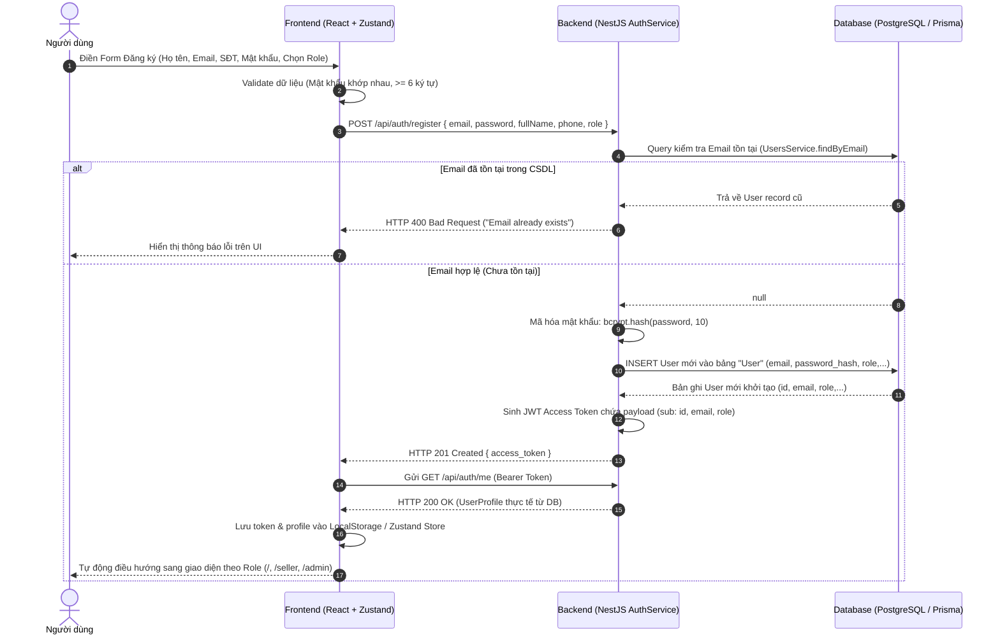
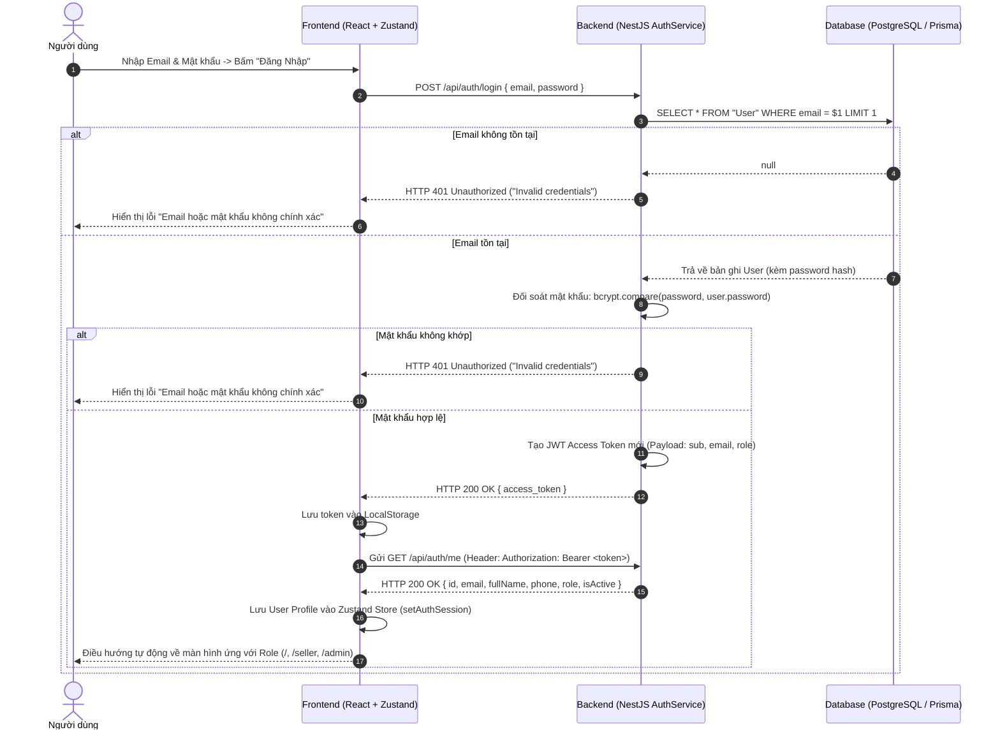
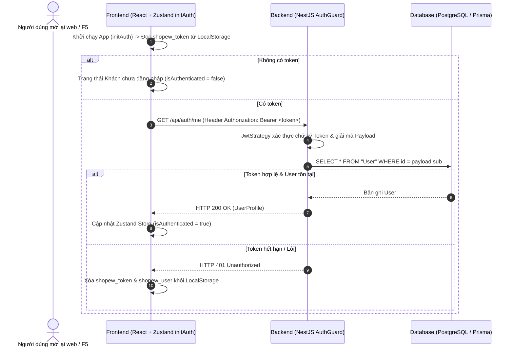

# Tài Liệu Luồng Xử Lý Hệ Thống Shopew (Phase 1: Auth & Core Setup)

> **Mô tả:** Tài liệu này tổng hợp toàn bộ các luồng giao tiếp dữ liệu giữa **Frontend (FE)**, **Backend (BE)** và **Database (DB)** sau khi hoàn thành Phase 1.

---

## 🏗️ Kiến Trúc Hệ Thống (Three-Tier Architecture)

- **Frontend (FE):** React.js + TypeScript + Vite + Tailwind CSS + Zustand (`useAuthStore`) + Axios Client (`api-client.ts`).
- **Backend (BE):** Node.js + NestJS Framework + JWT Passport Strategy + Bcrypt + Prisma ORM.
- **Database (DB):** PostgreSQL (Bảng `User`, `Address`, Enum `Role`: `CUSTOMER`, `SELLER`, `ADMIN`).
- **Base API URL:** `http://localhost:3000/api`
- **Tiền tệ chuẩn:** **VND (Việt Nam Đồng)**.

---

## 1. 📝 LUỒNG ĐĂNG KÝ TÀI KHOẢN (REGISTRATION FLOW)



### Chi tiết dữ liệu từng tầng:
1. **Frontend:** Gửi Request Payload `RegisterRequestPayload`:
   ```json
   {
     "email": "user@shopew.com",
     "password": "password123",
     "fullName": "Nguyễn Văn A",
     "phone": "0987654321",
     "role": "SELLER"
   }
   ```
2. **Backend:** Validate qua `RegisterDto`, băm mật khẩu qua `bcrypt.hash(dto.password, 10)`, gọi `prisma.user.create()`.
3. **Database:** Tạo bản ghi mới trong bảng `User`:
   - `id`: Tự tăng (Autoincrement).
   - `password`: Chuỗi mã hóa Bcrypt.
   - `role`: Enum `'CUSTOMER' | 'SELLER' | 'ADMIN'`.

---

## 2. 🔑 LUỒNG ĐĂNG NHẬP (LOGIN FLOW)



---

## 3. 🔄 LUỒNG KHÔI PHỤC SESSION KHI REFRESH TRANG (AUTO SESSION RESTORE)



---

## 4. 🛡️ LUỒNG BẢO VỆ ROUTE VÀ PHÂN QUYỀN (ROLE-BASED ROUTING)

- **Cấu hình Router Phân Quyền (`App.tsx` & `RoleGuard.tsx`):**
  - **Tuyến đường Mua sắm (`/`):** Cho phép tất cả người dùng (Public Route).
  - **Tuyến đường Cá nhân (`/user/profile`, `/user/address`):** Bảo vệ bởi `ProtectedRoute` (Yêu cầu đã Đăng nhập).
  - **Kênh Người Bán (`/seller`):** Bảo vệ bởi `RoleGuard allowedRoles={['SELLER', 'ADMIN']}`.
  - **Cổng Quản Trị Admin (`/admin`):** Bảo vệ bởi `RoleGuard allowedRoles={['ADMIN']}`.
- **Xử lý khi vi phạm quyền:** Nếu tài khoản `CUSTOMER` cố tình gõ URL `/admin`, `RoleGuard` sẽ chặn lại và hiển thị màn hình Cảnh báo *"Không Có Quyền Truy Cập"*, kèm nút đưa người dùng quay về Trang chủ.

---

## 5. 📧 LUỒNG ĐẶT LẠI MẬT KHẨU (FORGOT PASSWORD FLOW)

1. Người dùng bấm link **"Quên mật khẩu?"** tại màn hình Đăng nhập.
2. Modal hiển thị ô nhập Email -> Bấm **"Gửi Yêu Cầu Khôi Phục"**.
3. FE gửi HTTP Call `POST /api/auth/forgot-password` chứa `{ email }`.
4. BE tiếp nhận `ForgotPasswordDto`, tạo mock token reset bảo mật thời hạn 15 phút.
5. BE phản hồi thông báo dịu dàng ngăn chặn rò rỉ Email (Prevent Email Enumeration): Trả về `{ message: "If an account exists, a reset link has been sent." }`.

---

## 📊 BẢNG TÓM TẮT API ENDPOINTS PHASE 1

| Endpoint | Method | Header | Body Payload | Phản hồi (Data) | Mục đích |
| :--- | :--- | :--- | :--- | :--- | :--- |
| `/api/auth/register` | `POST` | N/A | `{ email, password, fullName, phone, role? }` | `{ access_token }` | Đăng ký tài khoản mới vào DB |
| `/api/auth/login` | `POST` | N/A | `{ email, password }` | `{ access_token }` | Xác thực đăng nhập & lấy Token |
| `/api/auth/me` | `GET` | `Bearer <token>` | N/A | `{ id, email, fullName, phone, role, isActive }` | Lấy Profile & Role thực tế từ CSDL |
| `/api/auth/forgot-password` | `POST` | N/A | `{ email }` | `{ message }` | Yêu cầu gửi link khôi phục mật khẩu |
